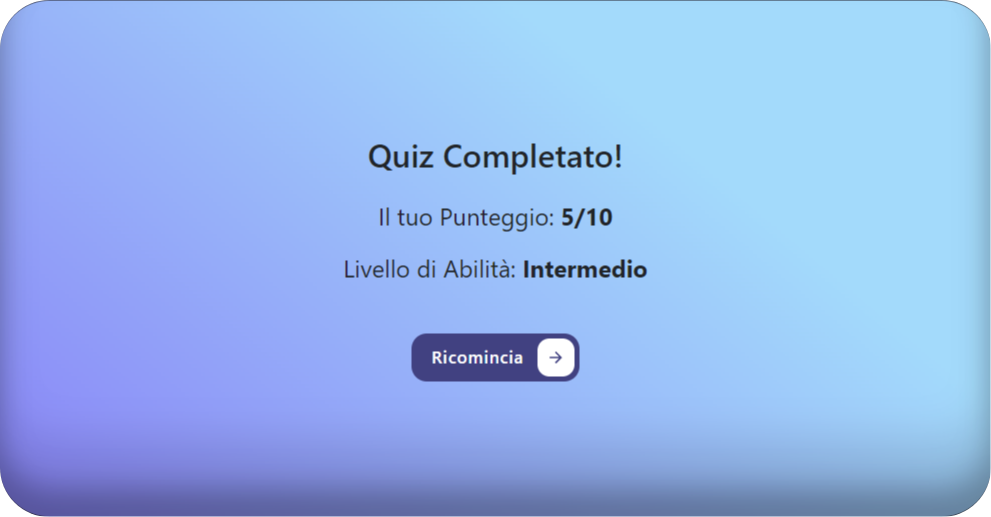

# StartToImpact: [TypeScript Quiz](https://lim-haru.github.io/typescript-quiz)

## Descrizione

Benvenuti nella webapp del Quiz sul Turismo Sostenibile! Questa progetto è una semplice applicazione web sviluppata utilizzando React e TypeScript, progettata per testare le conoscenze sull'argomento del turismo sostenibile.
Dopo aver completato il quiz, viene fornito un feedback istantaneo sul punteggio ottenuto, ed un livello di abilità raggiunto in basse alle risposte corrette.

### [Presentazione]()

<div align="center">
  
</div>
<div align="center">
  
</div>
<div align="center">
  
</div>

## Tecnologie Utilizzate

- React
- Typescript
- HTML5
- CSS
- JavaScript
- CSS Modules
- Bootstrap
- Helmet

## Come utilizzare il progetto

1. Clona il repository sul tuo computer:

```bash
git clone https://github.com/lim-haru/typescript-quiz.git
```

2. Entrare nella directory del progetto

```bash
cd typescript-quiz
```

3. Installare le dipendenze

```bash
npm install
```

4. Avviare l'applicazione

```bash
npm start
```

5. Apri il browser e vai all'indirizzo: [localhost:3000](http://localhost:3000)
